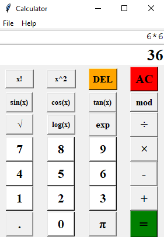

# Scientific-Calculator
A simple scientific calculator.

## Motivation :seedling:
 Had just learnt the basics of python and wanted to try something out, so I built this :smiley:
 
## Installation :package:
1. Clone the repo
```bash
   git clone https://github.com/aibenStunner/Calculator.git
   cd Calculator
```

## Usage :computer:

```bash
    python simpleCalculator.py
```

## Demo :video_camera:

This is a preview of the application.




## Built with :house:

- Tkinter
   
## Credits :open_book:
- Tkinter docs
  https://docs.python.org/3/library/tk.html
  
  
 ## License :key:
 
 LGPL-3.0
 &copy; Gadri Ebenezer
